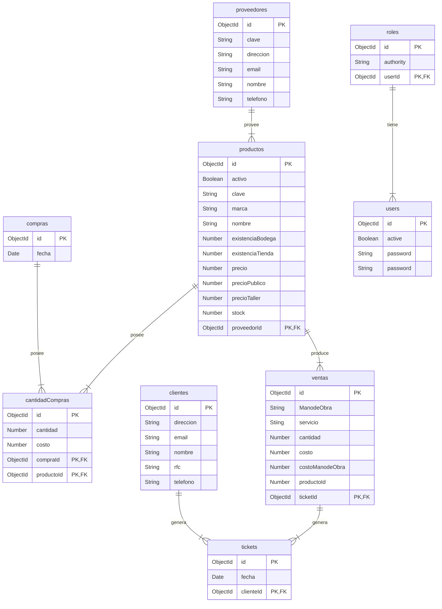

```mermaid
graph TD;
    subgraph Mostrar, crear, editar y eliminar
    API-->Ventas;
    API-->Clientes;
    API-->Proveedores;
    API-->Productos;
    API-->Usuarios;
    end
    subgraph Funcionalidad
    API-->CorteDeCaja;
    end
```
Diagrama de Base de datos basado en diagrama entidad Relación original


