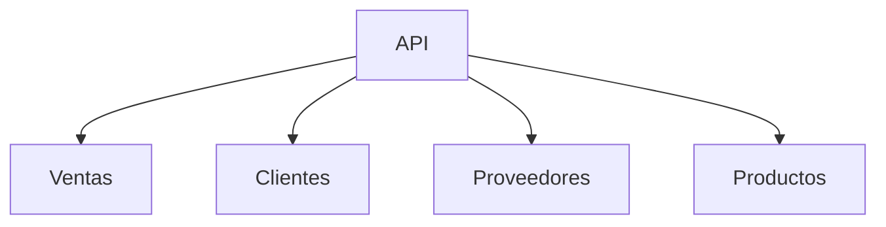
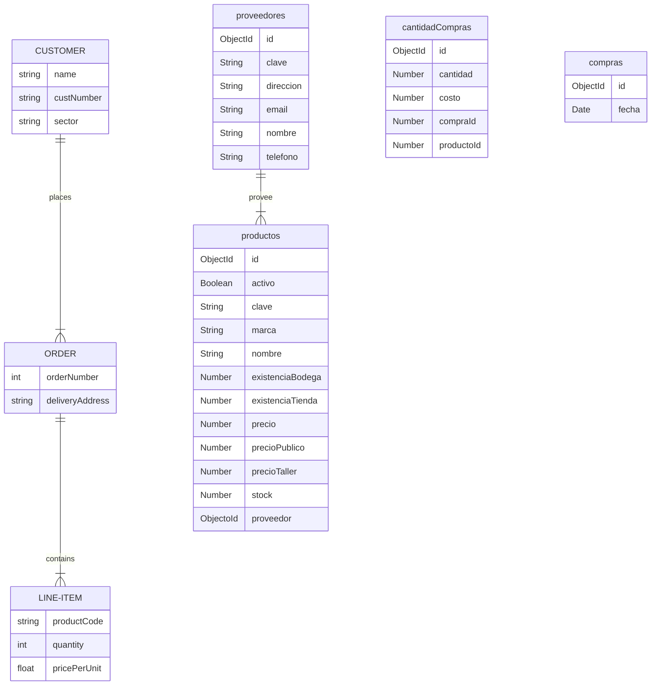

```mermaid
graph TD;
    API-->Ventas;
    API-->Clientes;
    API-->Proveedores;
    API-->Productos;
```
Diagrama de Base de datos basado en diagrama entidad Relación original

```mermaid
erDiagram
    CUSTOMER ||--|{ ORDER : places
    CUSTOMER {
        string name
        string custNumber
        string sector
    }
    proveedores ||--|{productos : provee
    productos {
        ObjectId id
        Boolean activo
        String clave
        String marca
        String nombre
        Number existenciaBodega
        Number existenciaTienda
        Number precio
        Number precioPublico
        Number precioTaller
        Number stock
        ObjectoId proveedor
    }
    proveedores {
        ObjectId id
        String clave
        String direccion
        String email
        String nombre
        String telefono
    }
    cantidadCompras{
        ObjectId id
        Number cantidad
        Number costo
        Number compraId
        Number productoId
    }
    compras{
        ObjectId id
        Date fecha
    }
    ORDER ||--|{ LINE-ITEM : contains
    ORDER {
        int orderNumber
        string deliveryAddress
    }
    LINE-ITEM {
        string productCode
        int quantity
        float pricePerUnit
    }
```
