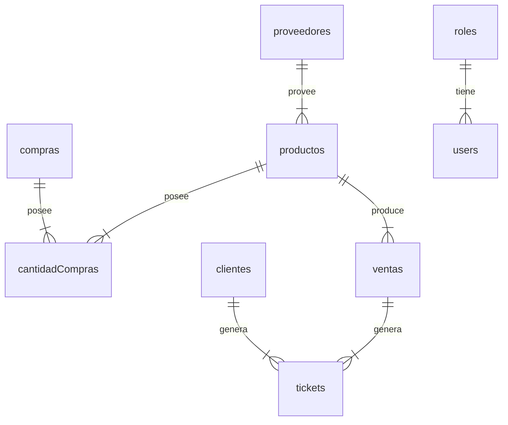

# BIGOW (BICIMOTOS GONZÁLES WEB)

Aqui se encuentra la documentación básica del proyecto

## Comandos básicos

### Para correr en modo desarrollo

```bash
npm run dev
```
durante en modo desarrollo se pueden ver los cambios en tiempo real

### Para hacer una build de producción

```bash
npm run build
```
una vez la build para producción está lista se puede ejecutar en modo producción

### Para correr en modo producción

```bash
npm run start
```
cuando se ejecuta en modo producción no se pueden observar los cambios que se realizan en el proyecto

Abre [http://localhost:3000](http://localhost:3000) para ver el resultado.

## Base de datos

la base de datos originalmente fue pensada para el paradigma relacional (SQL) pero actualmente funciona mediante MongoDb como base de datos basada en documentos (BSON).

### Diagrama de simplificado de la Base de datos para MongoDb


más detalles sobre la base de datos ver [DATABASE.md](https://github.com/DiegoSHS/bicimotos-gonzales-web/blob/main/docs/BATABASE.md) 
