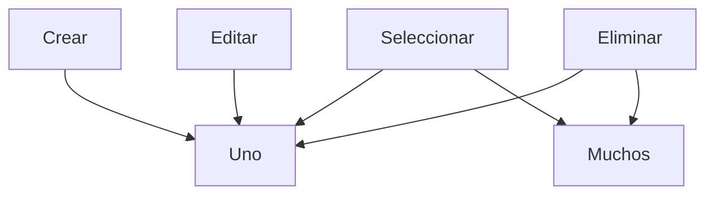

# Rutas de la API

aqui se muestran las rutas de la API del sistema
cada ruta de la API tiene las funcionalidades:



los elementos de las colecciones a las que hacen referencia

para ver las colecciones de la base de datos y su estructura consultar [DATABASE.md](https://github.com/DiegoSHS/bicimotos-gonzales-web/blob/main/docs/BATABASE.md)

```mermaid
graph TD;
    subgraph Mostrar, crear, editar y eliminar
    API-->Ventas;
    API-->Clientes;
    API-->Proveedores;
    API-->Productos;
    API-->Usuarios;
    end
    subgraph Funcionalidad
    API-->CorteDeCaja;
    end
```
